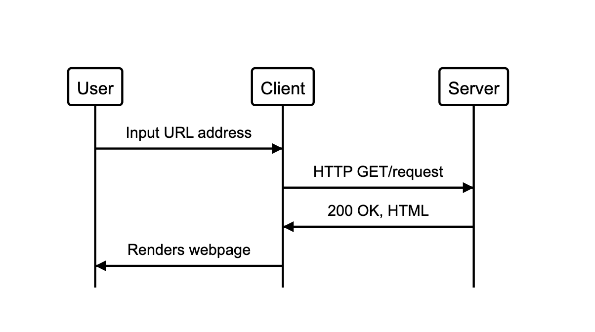

The website will have the following specification:

```
As a user,
So I can see my stored bookmarks
It should show a list of bookmarks
```

</p>
<br>
<p align="center">

<br><br>
</p>

```
As a user,
So I can update my list
I want to add new bookmarks
```

```
As a user,
So I can remove old bookmarks
I want to delete bookmarks
```

```
As a user,
So I can edit existing bookmarks
I want to be able to update bookmarks
```

```
As a user,
So I details about my bookmarks
I want to be able to comment on bookmarks
```

```
As a user,
So I can organise my bookmarks
I want to be able to tag bookmarks into categories
```

```
As a user,
So I can see specified bookmarks
I want to filter bookmarks by tag
```

```
As a user,
To control access to my bookmarks
Users are restricted to manage only their own bookmarks
```
